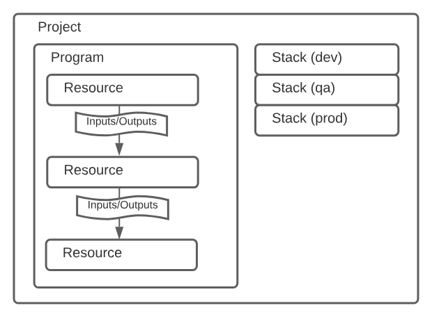

# Step 1: Create an EKS Cluster

The following steps guide you through the process of creating an EKS cluster on AWS, with the help of Pulumi IaC
framework.

<!-- TOC -->
* [Step 1: Create an EKS Cluster](#step-1-create-an-eks-cluster)
  * [About AWS EKS](#about-aws-eks)
    * [What is Kubernetes?](#what-is-kubernetes)
      * [Why container?](#why-container)
  * [About Pulumi](#about-pulumi)
    * [Why Pulumi?](#why-pulumi)
      * [The Dark Age before IaC](#the-dark-age-before-iac)
    * [Pulumi's Basic Concepts](#pulumis-basic-concepts)
  * [Initialize to Pulumi](#initialize-to-pulumi)
  * [Create the EKS Cluster via Pulumi (may take more than **_10_** minutes)](#create-the-eks-cluster-via-pulumi-may-take-more-than-10-minutes)
    * [What Happened?](#what-happened)
  * [[25 Scoring Point] Interact with the Newly Created EKS Cluster](#25-scoring-point-interact-with-the-newly-created-eks-cluster)
  * [[**Do Not Execute This Step until Lab 1 Finished**] Destroy the EKS Cluster via Pulumi](#do-not-execute-this-step-until-lab-1-finished-destroy-the-eks-cluster-via-pulumi)
<!-- TOC -->

## About AWS EKS

**EKS** makes it easy to deploy, manage, and scale production-grade Kubernetes clusters on AWS **without** having to manually maintain the **control plane**. It's a robust managed Kubernetes service optimized for AWS infrastructure.

### What is Kubernetes?

**Kubernetes** (also known as K8s) is an open-source container orchestration system for automating deployment, scaling, and management of **containerized applications**.

Kubernetes makes running containerized applications at scale simpler, more resilient, and consistent across infrastructure. Its architecture and ecosystem provide unique advantages for modern application deployments.

#### Why container?

There are several benefits to using containers to deploy applications compared to other approaches:

- **Portability**: Containers are a standard unit of software that can be run anywhere, including on-premises, in public clouds, and in hybrid environments.
- **Isolation**: Containers provide process isolation, which means that each containerized application runs in its own isolated environment. This isolation helps ensure that the application will not be affected by changes made to other applications.
- **Resource efficiency**: Containers are lightweight and share the host operating system's kernel. This means that containers use fewer resources than virtual machines (VMs) and can be started and stopped much more quickly.

## About Pulumi

**Pulumi** is an open-source infrastructure as code (IaC) platform that helps developers safely and predictably create, manage, and improve infrastructure. It provides a unified experience for managing infrastructure across multiple clouds and providers. Pulumi is controlled primarily using the command line interface (CLI).

### Why Pulumi?

Infrastructure as code (IaC) means using **code** to define and manage modern cloud infrastructure. IaC has many benefits, such as:

- **Version control** (Git)
- **Testing**: When infrastructure is complicated, the management process can be error-prone. We must test management process as the same as we test our application code.
- **DevOps**: Developers are also responsible for writing deployment code. Developers operate the infrastructure they create after application deployment.
- **High-level languages**: We can use high-level languages to write infrastructure code, such as Python, JavaScript, Go.
- Use of IDEs

#### The Dark Age before IaC

- GUIs and Dashboards

  Using graphical interfaces and dashboards to configure infrastructure through clicks instead of code. Such as AWS web console, Azure portal, GCP console, etc.

  Disadvantages:

  - Fragile point-and-click process
  - Changes are not reviewed or version controlled
  - Difficult to replicate
  - State is opaque and hard to document

- Scripting and Configuration Files

  Using scripts to automate some aspects of infrastructure management.

  Disadvantages:

  - Often rigid and linear
  - Limited abstraction
  - Difficult to maintain long term
  - Lack validation logic and tests

### Pulumi's Basic Concepts



- **Resources**: A resource is a unit of cloud infrastructure that can be created, configured, and managed with Pulumi. Resources can be anything from virtual machines to databases to storage buckets.
- **Programs**: A program is a piece of code that managing a collection of resources. Programming language can be Python, JavaScript, or Go.
- **Stack**: A stack is an isolated, independently configurable instance of a Pulumi program. Stacks are commonly used to denote different phases of development (such as dev, staging, and prod) or feature branches (such as feature-x-dev). A stack has two main components:
  - **Configuration**: The Pulumi stack config file is a YAML file that contains configuration values, which are **defined in program**, for a specific stack. The file is named `Pulumi.<stack-name>.yaml`.
  - **State**: The state of a Pulumi stack is a snapshot of all the resources in that stack. The state is stored in local files or in a cloud service such as Pulumi's SaaS backend and AWS S3.

## Initialize to Pulumi

```bash
$ pulumi login --local
$ export PULUMI_CONFIG_PASSPHRASE="" # Set passphrase env to `""`. This passphrase is required by Pulumi and was created by Lab maintainer.
$ pulumi stack select default -c # Select the `default` stack.
```

## Create the EKS Cluster via Pulumi (may take more than **_10_** minutes)

```bash
$ pulumi up
Updating (default):

     Type                      Name                            Status
+   pulumi:pulumi:Stack        1-create-an-eks-cluster-default created
+   └─ eks:index:Cluster       my-eks                          created
    ... dozens of resources omitted ...
```

### What Happened?


1. A developer writes a **Pulumi program** that defines the desired state of their infrastructure.
2. The Pulumi program is compiled and executed by a **language host**, which is TypeScripts in this lab.
3. The language host generates a representation of the **desired state** of the infrastructure.
4. The Pulumi deployment engine **compares** the desired state with the current state of the infrastructure.
5. The deployment engine creates, updates, or deletes resources as needed to **bring** the infrastructure **into** the desired state.
6. The deployment engine **records** the current state of the infrastructure as the new desired state.

## [25 Scoring Point] Interact with the Newly Created EKS Cluster

```bash
$ pulumi stack output kubeconfig > kubeconfig.yaml
$ export KUBECONFIG=$PWD/kubeconfig.yaml

$ kubectl get nodes
NAME                                            STATUS   ROLES    AGE   VERSION
ip-xxx-xxx-xxx-xxx.us-west-2.compute.internal   Ready    <none>   27m   v1.27.1-eks-2f008fe
ip-xxx-xxx-xxx-xxx.us-west-2.compute.internal   Ready    <none>   27m   v1.27.1-eks-2f008fe
```

## [**Do Not Execute This Step until Lab 1 Finished**] Destroy the EKS Cluster via Pulumi

```bash
$ export PULUMI_CONFIG_PASSPHRASE="" # Set passphrase env to `""`. This passphrase is required by Pulumi and was created by Lab maintainer.
$ pulumi destroy -y -s default
```
