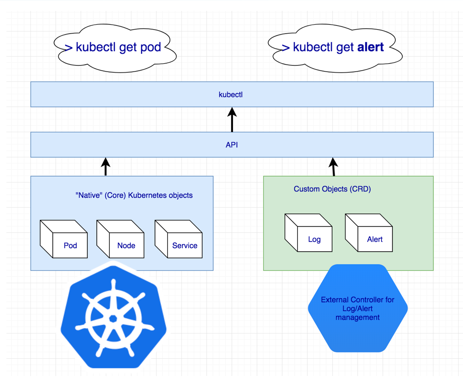
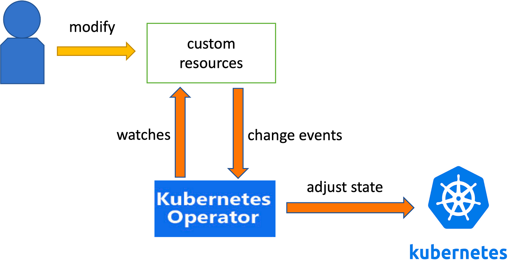
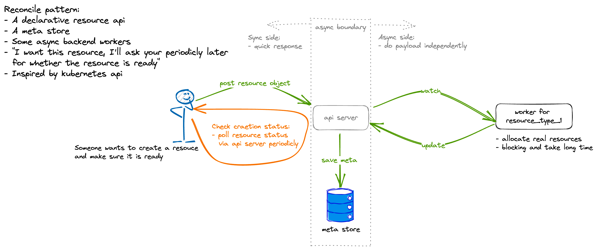

# Step 2: Deploy a TiDB Cluster with TiDB Operator

The following steps guides you through the process of scaling TiKV instance for a TiDB Operator managed cluster. It takes about
10 minutes to complete.

> - Please make sure you have completed [Step 1: Create an EKS cluster](../1-create-an-eks-cluster/README.md) and use
    **_the same shell session_** before proceeding.
> - If you have closed the shell session, please run `export KUBECONFIG=$PWD/../1-create-an-eks-cluster/kubeconfig.yaml`
    to load the kubeconfig env.

<!-- TOC -->
* [Step 2: Deploy a TiDB Cluster with TiDB Operator](#step-2-deploy-a-tidb-cluster-with-tidb-operator)
  * [Initialize to Pulumi](#initialize-to-pulumi)
  * [About Operator Pattern](#about-operator-pattern)
    * [What is CRD?](#what-is-crd)
    * [What is Operator?](#what-is-operator)
    * [How Do We Interact with Operator?](#how-do-we-interact-with-operator)
    * [How Does Operator Work?](#how-does-operator-work)
      * [Reconcile Pattern](#reconcile-pattern)
  * [Deploy TiDB Operator and TiDB Cluster via Pulumi](#deploy-tidb-operator-and-tidb-cluster-via-pulumi)
    * [TiUP(Bare-Metal) vs TiDB Operator(On-Kubernetes)](#tiupbare-metal-vs-tidb-operatoron-kubernetes)
  * [[25 Scoring Point] Wait for TiDB Cluster Ready](#25-scoring-point-wait-for-tidb-cluster-ready)
<!-- TOC -->

## Initialize to Pulumi

```bash
$ pulumi login --local
$ export PULUMI_CONFIG_PASSPHRASE="" # Set passphrase env to `""`. This passphrase is required by Pulumi and was created by Lab maintainer.
$ pulumi stack select default -c # Select the `default` stack.
```

## About Operator Pattern

**CRDs** (Custom Resource Definitions) along with **Operators** provide a powerful way to extend Kubernetes and manage complex stateful applications.

### What is CRD?

> - Think of a Custom Resource Definition (CRD) as a Class in Java and the Custom Resource (CR) as an instance of that class.
> - Think of a CRD as a table in a database and the CR as a row in that table.
> - Think of a CRD as a struct type in Go and the CR as an instance value of that struct.



In Kubernetes, a Custom Resource Definition (CRD) is a Kubernetes object that defines the **schema** for a custom resource. The schema defines the name, type, and properties of the custom resource.
Once a CRD is created, custom resources of that type can be created, updated, and deleted using the Kubernetes API. Custom resources can be used to represent any type of object, such as a database, a service, or a virtual machine.
Custom resources are a powerful way to extend the capabilities of Kubernetes. They can be used to manage any type of object that is not natively supported by Kubernetes.

### What is Operator?

> - Think of an Operator as a thread in Java, which manages the lifecycle of a CR.
> - Think of an Operator as a backend application executing SQL to a database. It performs CRUD operations on CR records.

Operators are software extensions to Kubernetes that use custom resources to manage applications and their components.

At first, there is Kubernetes, which is capable of scaling and being usable in extremely diverse contexts and applications.
To **do more complex things**, capability of Kubernetes must be **extended** and more sophisticated automations must be created,
suited to individual applications and their specific domain of action.
This is where the Operators come in.

### How Do We Interact with Operator?



- User **install** TiDB Operator and TiDB Cluster CRD to Kubernetes.
- User creates a **`TiDBCluster` Custom Resource (CR)** to Kubernetes.
- The operator **watches** for changes to the CR.
- If the operator detects that the `TiDBCluster` CR is not in the desired state, it will take action to **reconcile** the state.
- This may involve creating new database pods, updating existing database pods, or deleting database pods.
- The operator continues to monitor the database and take action as needed to ensure that the database is always in the desired state.

### How Does Operator Work?

Operators in Kubernetes are essentially **customized Kubernetes controllers** that encapsulate operational knowledge to manage the lifecycle of complex stateful applications.

**Reconcile loops** in controllers make Kubernetes a declarative system where you focus on specifying desired state via YAML while controllers ensure actual state matches it.

#### Reconcile Pattern



The term "**Reconcile**" comes from the implementation of Kubernetes controllers. It is a commonly used **asynchronous resource management design pattern**, used to decouple the contradictory processes of "user waiting for resources" and "slow resource creation". It has three core components:

- **API server** that handles synchronous requests
- Reliable resource **metadata storage**
- **Worker** that consumes requests and directly touches resources (the worker can have caches and working queues internally)

The Reconcile pattern allows the API server to immediately respond to user requests for resources. The actual asynchronous creation of the resources is handled in the background by the worker components. This prevents users from having to wait for resources to finish creating before getting a response. The reliable metadata storage acts as coordination point between API server and workers to ensure **eventual consistency**.

## Deploy TiDB Operator and TiDB Cluster via Pulumi

```bash
$ pulumi up
Updating (default):
     Type                                                                  Name                                      Status
     pulumi:pulumi:Stack                                                   2-deploy-tidb-with-tidb-operator-default
 +-  ├─ kubernetes:helm.sh/v3:Release                                      tidb-operator                             craeted (22s)
     ├─ kubernetes:yaml:ConfigGroup                                        tidb-operator-crds
     │  └─ kubernetes:yaml:ConfigFile                                      crds/tidb-operator-v1.4.4.yaml
 +-  │     ├─ kubernetes:apiextensions.k8s.io/v1:CustomResourceDefinition  tidbinitializers.pingcap.com              craeted (2s)
     ... dozens of resources omitted ...
```

### TiUP(Bare-Metal) vs TiDB Operator(On-Kubernetes)

> TiUP is a command-line component management tool that can help to download and install TiDB components to the local system (bare-metal).

> What is bare-metal?
> Bare metal refers to deploying and running software applications directly on physical servers, without any underlying containerization layers.

In summary, TiUP offers simplicity while TiDB Operator provides cloud-native portability, automation, and ecosystem leverage on Kubernetes.

- TiUP (Bare Metal):

  Pros:

  - **Simpler installation** - Single binary to directly deploy TiDB on servers. No need for Kubernetes.
  - **Bare metal performance** - No overhead from containerization so can achieve lower latency and higher throughput.
  - Targeted for TiDB - Specialized for TiDB deployments and workflows. Not a general Kubernetes app manager.

  Cons:

  - **Limited portability** - Tightly coupled to specific bare metal servers. Difficult to migrate or burst to cloud.
  - **Manual management** - Scaling, upgrades, repairs require human intervention. Lacks automated recoveries.

- TiDB Operator (Kubernetes):

  Pros:
  - **True cloud-native** - Fully leverages Kubernetes concepts like pods, services, deployments, configmaps.
  - **Broad ecosystem** - Benefits from all Kubernetes supporting tools and services for observability, security, RBAC, pipelines.
  - **Automated operations** - Handles scaling, failovers, upgrades, repairs automatically through Kubernetes.
  - **Storage integration** - Easy to integrate cloud storage like PV/PVC abstractions.
  - **Microservices friendly** - Kubernetes is ideal platform for microservices architectures.

## [25 Scoring Point] Wait for TiDB Cluster Ready

```bash
$ kubectl get po
NAME                                       READY   STATUS    RESTARTS   AGE
basic-discovery-cff6d579c-npzmv            1/1     Running   0          60m
basic-monitor-0                            4/4     Running   0          60m
basic-pd-0                                 1/1     Running   0          29m
basic-tidb-0                               2/2     Running   0          27m
basic-tidb-dashboard-0                     1/1     Running   0          29m
basic-tikv-0                               1/1     Running   0          28m
tidb-controller-manager-75959db68d-gdbv6   1/1     Running   0          61m
tidb-scheduler-55d58fdd7f-kch9g            2/2     Running   0          61m
```
