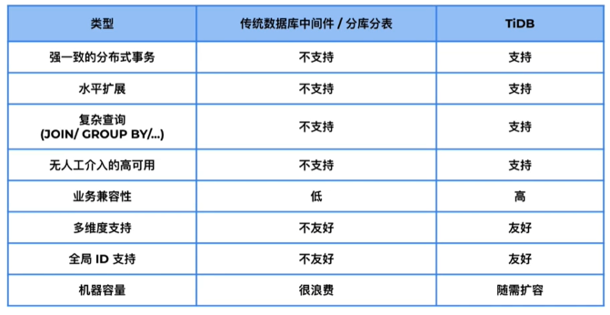
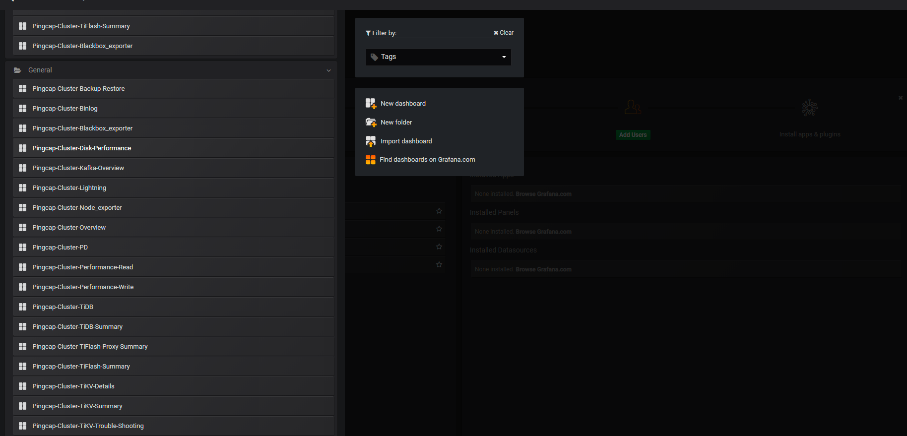

# Step 3: Explore TiDB Basic Usage

The following steps guides you the basic usage of a newly deployed TiDB cluster. It takes about 10 minutes to complete.

> - Please make sure you have completed [Step 1: Create an EKS cluster](../1-create-an-eks-cluster/README.md) and use
    **_the same shell session_** before proceeding.
> - If you have closed the shell session, please run `export KUBECONFIG=$PWD/../1-create-an-eks-cluster/kubeconfig.yaml`
    to load the kubeconfig env.

<!-- TOC -->
* [Step 3: Explore TiDB Basic Usage](#step-3-explore-tidb-basic-usage)
  * [About TiDB](#about-tidb)
    * [Why TiDB Cluster (Compare to A MySql Instance)?](#why-tidb-cluster-compare-to-a-mysql-instance)
  * [List All Services Related to TiDB Cluster](#list-all-services-related-to-tidb-cluster)
  * [Set up Port-Forward to TiDB Cluster, TiDB Dashboard and Grafana](#set-up-port-forward-to-tidb-cluster-tidb-dashboard-and-grafana)
  * [Access TiDB Dashboard and Grafana in Browser](#access-tidb-dashboard-and-grafana-in-browser)
  * [[20 Scoring Point] Access TiDB Cluster via MySQL Client](#20-scoring-point-access-tidb-cluster-via-mysql-client)
    * [Create A `hello_world` Table](#create-a-helloworld-table)
    * [Query the TiDB Version](#query-the-tidb-version)
    * [Query the TiDB Cluster Information](#query-the-tidb-cluster-information)
<!-- TOC -->

## About TiDB

TiDB is an open-source, distributed SQL database that supports Hybrid Transactional and Analytical Processing (HTAP) workloads. It's MySQL compatible, and offers horizontal scalability, strong consistency, and high availability.

### Why TiDB Cluster (Compare to A MySql Instance)?

Scalability



High-performance analytics with strong consistency and less technical complexity

## List All Services Related to TiDB Cluster

```bash
$ kubectl get svc -l app.kubernetes.io/instance=basic
NAME                           TYPE        CLUSTER-IP       EXTERNAL-IP   PORT(S)               AGE
basic-discovery                ClusterIP   10.100.47.151    <none>        10261/TCP,10262/TCP   103m
basic-grafana                  ClusterIP   10.100.178.153   <none>        3000/TCP              103m
basic-monitor-reloader         ClusterIP   10.100.152.145   <none>        9089/TCP              103m
basic-pd                       ClusterIP   10.100.126.85    <none>        2379/TCP              103m
basic-pd-peer                  ClusterIP   None             <none>        2380/TCP,2379/TCP     103m
basic-prometheus               ClusterIP   10.100.252.76    <none>        9090/TCP              103m
basic-tidb                     ClusterIP   10.100.205.182   <none>        4000/TCP,10080/TCP    70m
basic-tidb-dashboard-exposed   ClusterIP   10.100.66.234    <none>        12333/TCP             103m
basic-tidb-peer                ClusterIP   None             <none>        10080/TCP             70m
basic-tikv-peer                ClusterIP   None             <none>        20160/TCP             71m
```

## Set up Port-Forward to TiDB Cluster, TiDB Dashboard and Grafana

```bash
$ ./set-up-port-forward.sh
Forwarding from 127.0.0.1:12333 -> 12333
Forwarding from 127.0.0.1:3000 -> 3000
Forwarding from [::1]:12333 -> 12333
Forwarding from [::1]:3000 -> 3000
Forwarding from 127.0.0.1:4000 -> 4000
Forwarding from [::1]:4000 -> 4000
```

## Access TiDB Dashboard and Grafana in Browser

- TiDB Dashboard: http://localhost:12333, with **_empty_** password

  

- Grafana: http://localhost:3000, with `admin`/`admin` as username/password

  

## [20 Scoring Point] Access TiDB Cluster via MySQL Client

In another shell session, run:

```bash
$ mysql --comments -h 127.0.0.1 -P 4000 -u root
```

### Create A `hello_world` Table

```bash
mysql> use test;
mysql> create table hello_world (id int unsigned not null auto_increment primary key, v varchar(32));
Query OK, 0 rows affected (0.17 sec)

mysql> select * from information_schema.tikv_region_status where db_name=database() and table_name='hello_world'\G
*************************** 1. row ***************************
       REGION_ID: 2
       START_KEY: 7480000000000000FF3700000000000000F8
         END_KEY:
        TABLE_ID: 55
         DB_NAME: test
      TABLE_NAME: hello_world
        IS_INDEX: 0
        INDEX_ID: NULL
      INDEX_NAME: NULL
  EPOCH_CONF_VER: 5
   EPOCH_VERSION: 23
   WRITTEN_BYTES: 0
      READ_BYTES: 0
APPROXIMATE_SIZE: 1
APPROXIMATE_KEYS: 0
1 row in set (0.03 sec)
```

### Query the TiDB Version

```bash
mysql> select tidb_version()\G
*************************** 1. row ***************************
         tidb_version(): Release Version: v7.1.0
                Edition: Community
        Git Commit Hash: 635a4362235e8a3c0043542e629532e3c7bb2756
             Git Branch: heads/refs/tags/v7.1.0
         UTC Build Time: 2023-05-30 10:58:57
              GoVersion: go1.20.3
           Race Enabled: false
       TiKV Min Version: 6.2.0-alpha
Check Table Before Drop: false
                  Store: tikv
1 row in set (0.01 sec)
```

### Query the TiDB Cluster Information

```bash
mysql> select * from information_schema.cluster_info\G
*************************** 1. row ***************************
          TYPE: tidb
      INSTANCE: basic-tidb-0.basic-tidb-peer.default.svc:4000
STATUS_ADDRESS: basic-tidb-0.basic-tidb-peer.default.svc:10080
       VERSION: 7.1.0
      GIT_HASH: 635a4362235e8a3c0043542e629532e3c7bb2756
    START_TIME: 2023-06-09T04:39:33Z
        UPTIME: 1h28m2.256186392s
     SERVER_ID: 3072852
*************************** 2. row ***************************
          TYPE: pd
      INSTANCE: basic-pd-0.basic-pd-peer.default.svc:2379
STATUS_ADDRESS: basic-pd-0.basic-pd-peer.default.svc:2379
       VERSION: 7.1.0
      GIT_HASH: 1ff614d90412396c9ebaad76a30d31e683c34adc
    START_TIME: 2023-06-09T04:37:59Z
        UPTIME: 1h29m36.256191795s
     SERVER_ID: 0
*************************** 3. row ***************************
          TYPE: tikv
      INSTANCE: basic-tikv-0.basic-tikv-peer.default.svc:20160
STATUS_ADDRESS: basic-tikv-0.basic-tikv-peer.default.svc:20180
       VERSION: 7.1.0
      GIT_HASH: 0c34464e386940a60f2a2ce279a4ef18c9c6c45b
    START_TIME: 2023-06-09T04:38:45Z
        UPTIME: 1h28m50.256194511s
     SERVER_ID: 0
3 rows in set (0.22 sec)
```
