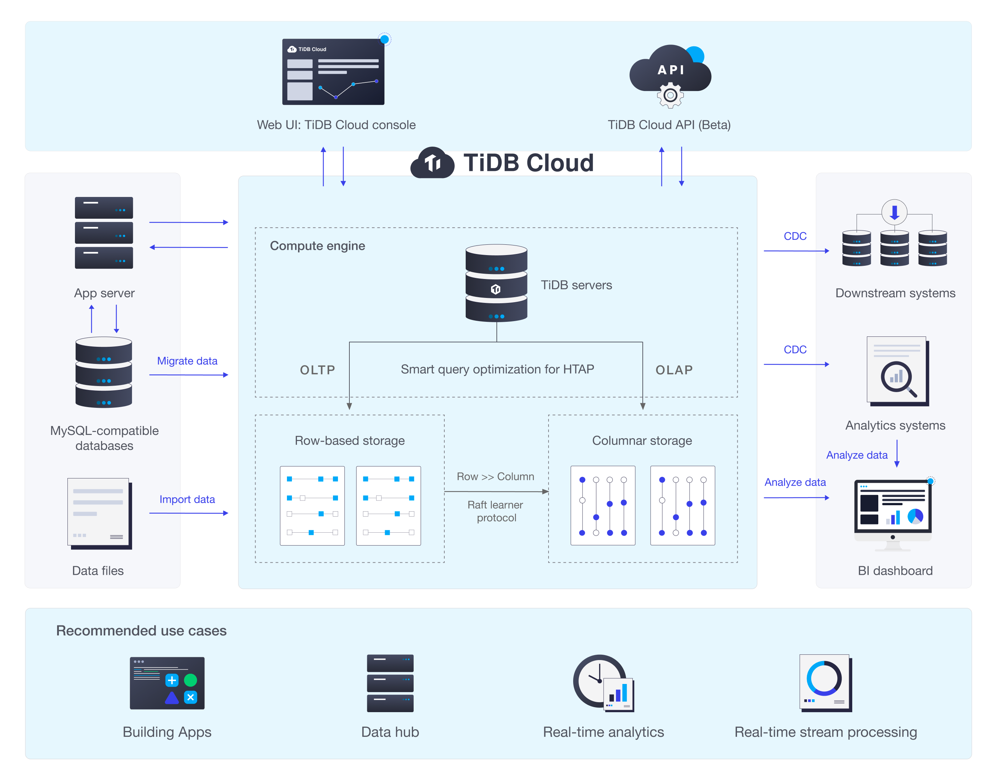

# Lab 1: Deploy TiDB Cluster on AWS EKS

This lab deploys a **TiDB cluster** on an **AWS EKS**. The TiDB cluster is managed by **TiDB-Operator**, and the deployment process is automated with **Pulumi**.

<!-- TOC -->
* [Lab 1: Deploy TiDB Cluster on AWS EKS](#lab-1-deploy-tidb-cluster-on-aws-eks)
  * [Introduction](#introduction)
    * [About TiDB Cloud](#about-tidb-cloud)
  * [Learning Objectives](#learning-objectives)
  * [Pre-Requisites](#pre-requisites)
  * [Syllabus](#syllabus)
  * [AWS billing price](#aws-billing-price)
<!-- TOC -->

## Introduction

**Cloud computing** is the delivery of computing **services** -- including servers, storage, databases, networking, software, analytics, and intelligence -- over the internet ("the cloud") to offer faster innovation, flexible resources, and economies of scale, as your business needs change.

**Amazon EKS** is a managed Kubernetes service that makes it easy for you to run **Kubernetes** on AWS. Kubernetes offers automating deployment, scaling, and management of containerized applications.

**TiDB** is an open-source distributed SQL database that supports HTAP workloads. It provides users with a one-stop database solution, and helps improve scalability, availability and reliability for users' data storage systems.

When deploying TiDB clusters on AWS EKS, users can gain all features provided by TiDB, while leverage the benefits of operating TiDB clusters on managed Kubernetes services.

### About TiDB Cloud

TiDB Cloud is a fully-managed Database-as-a-Service (DBaaS) that brings TiDB, an open-source Hybrid Transactional and Analytical Processing (HTAP) database, to your cloud. TiDB Cloud offers an easy way to deploy and manage databases to let you focus on your applications, not the complexities of the databases. You can create TiDB Cloud clusters to quickly build mission-critical applications on Google Cloud Platform (GCP) and Amazon Web Services (AWS).

**At PingCAP, we build TiDB Cloud based on technologies covered in this Lab 1!**

## Learning Objectives

- Understand basic usage of Kubernetes
- Understand basic usage of AWS Kubernetes service (EKS)
- Understand the fundamentals of operator pattern
- Learn to deploy TiDB clusters on Kubernetes with TiDB Operator
- Understand basic usage of TiDB cluster
- Automate deployment process with Pulumi IaC framework

## Pre-Requisites

- An AWS account
- VPN for connecting to AWS API and GitHub
- Linux or MacOS or WSL2 environments

## Syllabus

> 100 basic points + 20 bonus points = 120 total points.

- Step 0: Install Dependencies [`0-install-dependencies`](./0-install-dependencies/README.md)

1. (25 points) Create an EKS cluster [`1-create-an-eks-cluster`](./1-create-an-eks-cluster/README.md)
2. (25 points) Deploy TiDB with TiDB
   Operator [`2-deploy-tidb-with-tidb-operator`](./2-deploy-tidb-with-tidb-operator/README.md)
3. (20 points) Explore TiDB basic usage [`3-explore-tidb-basic-usage`](./3-explore-tidb-basic-usage/README.md)
4. (20 points) Scale up TiDB cluster with TiDB
   Operator [`4-scale-up-tidb-cluster-with-tidb-operator`](./4-scale-up-tidb-cluster-with-tidb-operator/README.md)
5. (10 points) Cleanup: Destroy the EKS cluster [`finished-destroy-the-eks-cluster-via-pulumi`](./1-create-an-eks-cluster/README.md#do-not-execute-this-step-until-lab-1-finished-destroy-the-eks-cluster-via-pulumi)

- (20 bonus points) Bonus: Config the TiDB slow-log threshold and update the cluster with Pulumi [[bonus]config-slow-log-threshold](./[bonus]config-slow-log-threshold/README.md)

---

## AWS billing price

This lab will incur charges under the AWS account, described in detail at:

- New EKS cluster control plane, **_1_** cluster x **_0.10_** USD per hour
- Two EKS worker EC2 `t2.medium` instances, **_2_** instances * **_0.0464_** USD per hour
- 4 EBS of size 1 GiB, with negligible cost

Total **_0.1928_** USD per hour.
