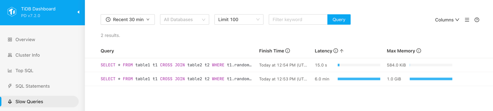

# Bonus Point: Config the TiDB Slow-Log Threshold

<!-- TOC -->
* [Bonus Point: Config the TiDB Slow-Log Threshold](#bonus-point-config-the-tidb-slow-log-threshold)
  * [What is TiDB Slow-log?](#what-is-tidb-slow-log)
  * [Why We Need to Adjust Slow-Log Threshold?](#why-we-need-to-adjust-slow-log-threshold)
  * [How to Config Slow-Log Threshold?](#how-to-config-slow-log-threshold)
  * [What Kinds of SQL Statements May Slow Down?](#what-kinds-of-sql-statements-may-slow-down)
  * [[20 Scoring Points] What You Could Do?](#20-scoring-points-what-you-could-do)
<!-- TOC -->

## What is TiDB Slow-log?

**TiDB Slow-log** is a feature of TiDB that records SQL statements that take longer than a certain threshold to execute. This information can be used to identify and troubleshoot slow queries.

TiDB slow log tracks queries exceeding a defined execution time threshold to provide critical insights into system performance that can be used for optimization.

Please refer to: https://docs.pingcap.com/tidb/stable/dashboard-slow-query and https://docs.pingcap.com/tidb/stable/identify-slow-queries#fields-description for more details.

## Why We Need to Adjust Slow-Log Threshold?

- To control **the amount of data that is logged**: The slow-log threshold determines how long a query must take before it is logged. If you set the threshold too low, you will generate a lot of slow-log data. If you set the threshold too high, you might miss slow queries that are causing performance problems.
- To focus on **specific types of slow queries**: The slow-log can be used to log different types of slow queries, such as queries that are using inefficient indexes or that are performing unnecessary joins. If you are only interested in a specific type of slow query, you can set the slow-log threshold to only log those types of queries.
- To meet **read business workload** requirements: Business workload varies from company to company. For example, some companies may require that the response time of read requests be less than 1 second. In this case, you can set the slow-log threshold to 1 second to ensure that the slow-log can record all read requests that take longer than 1 second to execute.

## How to Config Slow-Log Threshold?

There are two ways to config slow-log threshold:

- `tidb_slow_log_threshold` session variable: https://docs.pingcap.com/tidb/stable/system-variables#tidb_slow_log_threshold
- The `instance.tidb_slow_log_threshold` TiDB parameter: https://docs.pingcap.com/tidb/stable/tidb-configuration-file#tidb_slow_log_threshold

The 2nd way is recommended, because it is persistent and will not be affected by TiDB restart.

## What Kinds of SQL Statements May Slow Down?

In a distributed database like TiDB, there are some types of SQL queries that tend to run slower and are more likely to show up in the slow query log:

- **Large table scans** - Queries that need to scan large amounts of data across many nodes. This adds network overhead.
- **Expensive joins** - Joins that require shuffling large amounts of data across the network between nodes. Hash joins tend to be slower.
- **Data skews** - Queries hitting hotspot regions with disproportionate load imbalance slower execution.
- **Unoptimized indexes** - Missing indexes or incorrect index selection forces full table scans.
- **Large sorts** - Queries requiring sorting large data sets consume excessive memory and CPU.

For more details, please refer to: https://docs.pingcap.com/tidb/dev/sql-tuning-overview.

## [20 Scoring Points] What You Could Do?

- (5 points) Adjust slow-log threshold via Pulumi and TiDB Operator. The threshold should be larger than **5000 ms**.
- (10 points) Design several SQL Statements whose execution duration is larger than configured slow-log threshold.
- (5 points) Execute these SQL Statements and monitor slow queries page of TiDB Dashboard to see whether the newly configured threshold takes effect.

Show your SQL Statements and screenshots of slow queries page in your report.

Example:

